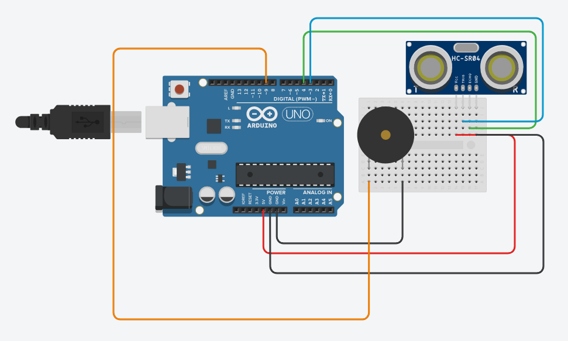

## Bengala Upgraded
This project is based in a outher project created by studants of IFMT
(Federal Institute of Mato Grosso) in Brazil, but this mencioned project
not is Open Source, because this we (Students of Microcamp in Arapiraca)
decided to create a Open Source version to make a experimet with outhers
studants to tell about the importance of Open Source for people with
disbilities.

### What this project do?
This project is a walkstick for visually impaired people, but this one can
solve a traditional problem thats occurs every time, the traditional walkstick
can't touch something is above itself making the person bumb in the floating
thing. What this project do is simple: It tells to the person if is something
above the stick, with sounds of buzzer (or vibration for some cases of blindness)

This project accept all issues and pull requests, so if you have a good idea
don't be shy to share with us. :smile:

### The project working
- Comming soon.

### How to build this?
First you need this materials to start:

**Software:**

- Arduino IDE or [Arduino Makefile](https://github.com/sudar/arduino-makefile) to compile code.
- [HCSR04](https://github.com/Martinsos/arduino-lib-hc-sr04) library by Martin Šošić.

**Hardware:**

- **1**X Arduino UNO or Arduino Nano;
- **1**X Ultrassonic sensor (HC-SR04);
- **120**CM Ethernet cable (To use in conections of components)
- **1**X 3.3V Buzzer.

**Sugestions of things to use as a walkstick (thats we recommend):**

- Traditional walkstick for blind people;
- Tree stick (Why not?);
- Sefie stick.

The stick you can use and do anything you want, thats mean if you want to add
something in your project you are free to do it, this is the real meaning
of Open Source, the future is adapt to every needs.

After have all required items you need to make this simple scheme with your
Arduino:

After this you need to clone the repository and compile with IDE or makefile
and it will work with no errors. If the project is not working well or having
any error, please check the next topic.

### Fix Errors
So to know if your project is having any error, check the monitor serial and
if the you see a message like this:

	Oh no! Something is not working well
	Please check the software's repository in Github for support of this error:
	www.github.com/Samuel-de-Oliveira/bengala_upgraded#fix-errors

This is a code error, to fix it check if one of these situations is same of yours:

1. The ultrasonic is not connected or the connections are wrong. (To solve you just need to connect the ultrassonic in your Arduino).
1. The constant `Height` is lower than 130cms (To solve you need to write a value higher than 130 cm).

If you don't see this message probably is something wrong in the circuit scheme,
so you need to check the connections again and check if some component is broken.

#### Version: *0.1 BETA*.
#### Owner of project: *Samuel de Oliveira*.
#### Project created by studants of Microcamp to a Open Source experiment.
